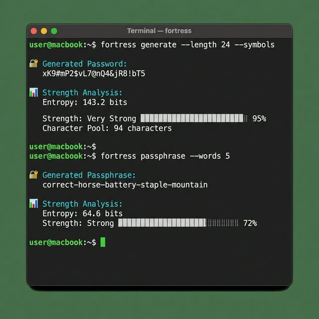

# 🏰 Fortress

[](https://github.com/hatimhtm/Fortress/actions/workflows/ci.yml)
[](https://www.python.org/downloads/)
[](https://opensource.org/licenses/MIT)

> A cryptographically secure password generator with entropy estimation.

Fortress uses Python's `secrets` module to generate passwords that are suitable for security-sensitive applications. It includes entropy calculation, strength estimation, and a beautiful CLI.

<p align="center">
  
</p>

## ✨ Features

| Feature | Description |
|---------|-------------|
| 🔐 Cryptographically Secure | Uses `secrets` module, not `random` |
| 📊 Entropy Calculation | Know exactly how strong your password is |
| ⏱️ Crack Time Estimation | See how long it would take to crack |
| 🎨 Beautiful CLI | Rich terminal output with colors and progress |
| 📦 Zero Dependencies | Core library has no dependencies |
| 🔧 Configurable | Customize character sets, length, and more |
| 🧪 Well Tested | 80%+ test coverage with pytest |

## 🚀 Installation

```bash
# Install core library only
pip install fortress

# Install with CLI support (recommended)
pip install "fortress[cli]"

# Install for development
pip install -e ".[dev]"
```

## 📖 Usage

### Command Line

```bash
# Generate a 16-character password (default)
fortress generate

# Generate a 32-character password
fortress generate -l 32

# Generate without symbols (for sites that don't allow them)
fortress generate --no-symbols

# Generate multiple passwords
fortress generate -c 5

# Generate a memorable passphrase
fortress passphrase

# Check strength of an existing password
fortress check "MyP@ssw0rd123"

# Quiet mode (just the password, for scripting)
fortress generate -q
```

### Python Library

```python
from fortress import generate_password, PasswordConfig, calculate_entropy

# Generate with defaults (16 chars, all character types)
password = generate_password()

# Generate with custom length
password = generate_password(length=32)

# Generate with custom configuration
config = PasswordConfig(
    length=24,
    use_symbols=False,
    exclude_ambiguous=True,  # No 0/O, 1/l/I confusion
)
password = generate_password(config=config)

# Check entropy
entropy = calculate_entropy(password)
print(f"Entropy: {entropy:.1f} bits")
```

## 📁 Project Structure

```
fortress/
├── __init__.py              # Public API
├── core/
│   ├── generator.py         # Password generation logic
│   └── entropy.py           # Strength calculation
├── cli/
│   └── __init__.py          # Typer CLI application
└── utils/
    └── display.py           # Terminal display utilities
```

## 🏗️ Architecture

- **Core Module**: Pure Python, no dependencies, cryptographically secure
- **CLI Module**: Optional, uses Typer and Rich for beautiful output
- **Utils Module**: Display helpers with graceful fallback

## 🔒 Security

Fortress uses `secrets.choice()` instead of `random.choice()`. The `secrets` module is specifically designed for generating cryptographically strong random numbers suitable for managing secrets such as passwords.

From the [Python docs](https://docs.python.org/3/library/secrets.html):
> The `secrets` module is used for generating cryptographically strong random numbers suitable for managing data such as passwords, account authentication, security tokens, and related secrets.

## 🧪 Development

```bash
# Clone and install
git clone https://github.com/hatimhtm/Fortress.git
cd Fortress
pip install -e ".[dev]"

# Run tests
pytest

# Run with coverage
pytest --cov=fortress --cov-report=html

# Lint
ruff check .

# Type check
mypy fortress
```

## 📊 Password Strength Guide

| Entropy (bits) | Strength | Crack Time* |
|----------------|----------|-------------|
| < 28 | Very Weak | Instantly |
| 28-35 | Weak | Minutes |
| 36-59 | Fair | Hours to days |
| 60-127 | Strong | Years |
| ≥ 128 | Very Strong | Centuries |

*Assuming 10 billion attempts/second

## 📄 License

[MIT](LICENSE)

---

### 👤 Author

**Hatim El Hassak** — Full-Stack Engineer

[](https://hatimelhassak.is-a.dev)
[](https://www.linkedin.com/in/hatim-elhassak/)
[](mailto:hatimelhassak.official@gmail.com)
